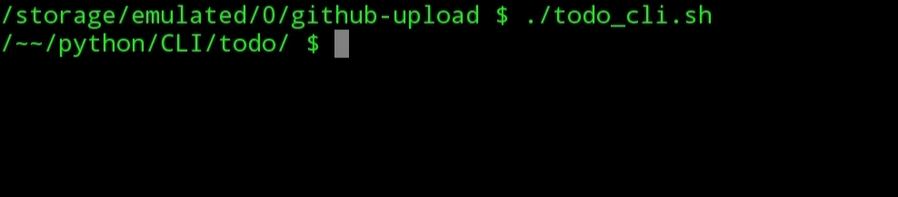
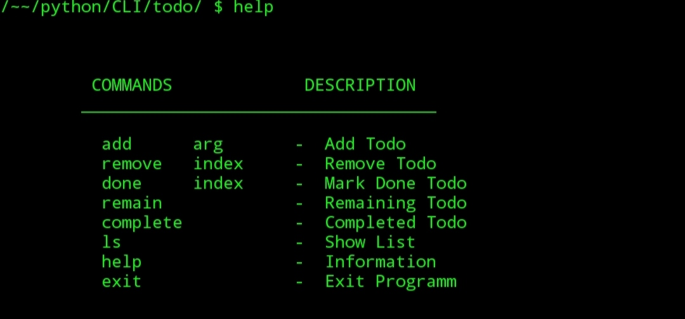
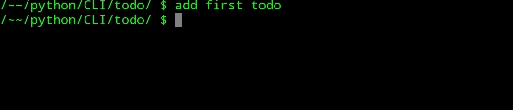
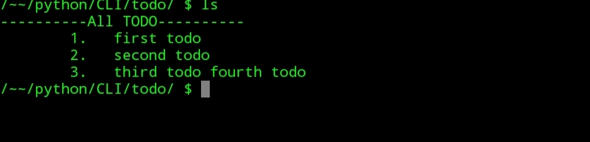
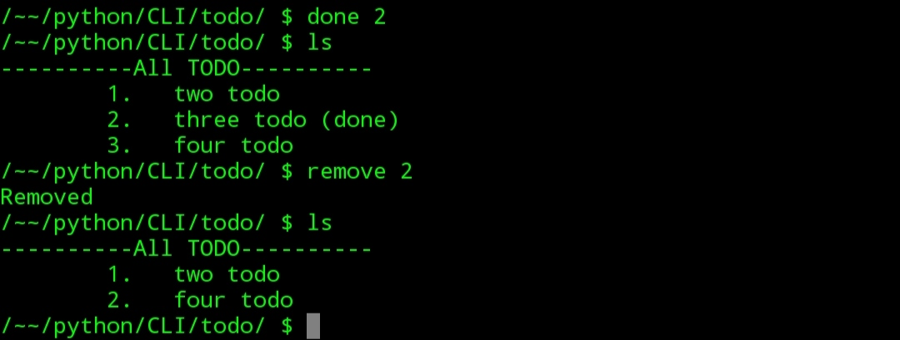
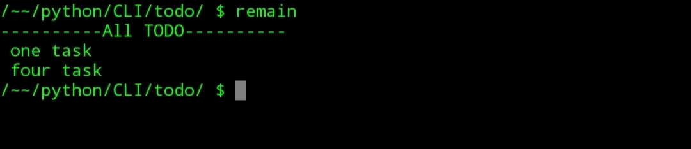

# python-cli-todo-program
A PYTHON CLI PROGRAM TO MANAGE TO-DO.

A simple python program to manage todo list.

To use this first clone this repository.

To clone this repository first go to terminal then go to the directory where you want to clone and  type
```bash
git clone https://github.com/dazal-32/python-cli-todo-program.git
```
Then if you are a linux or mac user type 
```bash
./todo_cli.sh
```



If the previous command shows permission denied, you can use the following one
```bash
bash todo_cli.sh 
```

For help type
```bash
help
```


For adding a TODO simply type 
```bash
add 
```
then type what you want to add.



If you want to see all TODOs type
```bash
ls
```



Mark a TODO as done or remove a TODO from the list , type
```bash
done
```
then index number.
```bash
remove 
```
then index number



See completed TODOs
```bash
complete 
```


See remaining TODOs
```bash
remain 
```


if you are a windows user type 
```bash
.\todo_cli.bat
```
And hit enter and all operations are same as previous.

 

